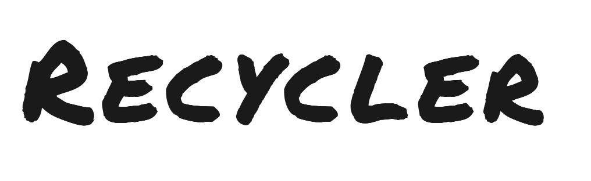
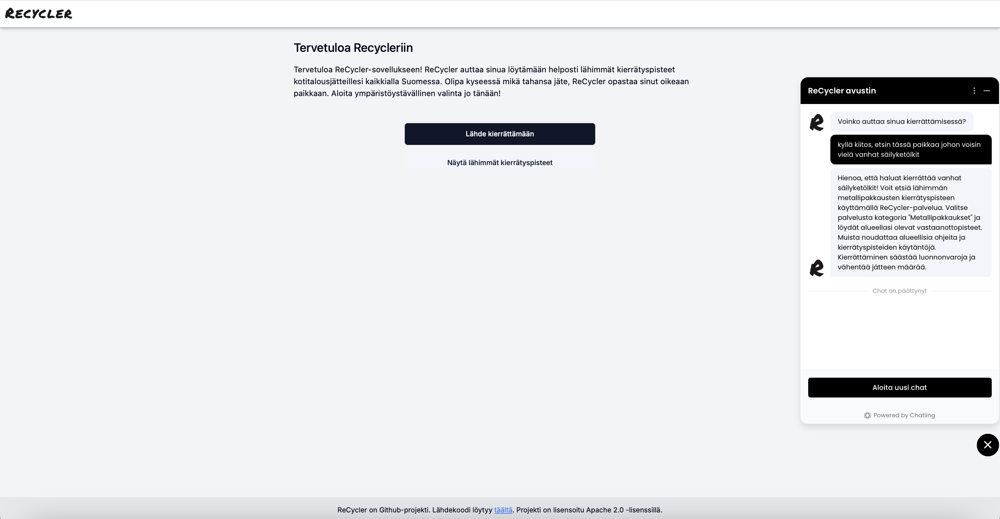
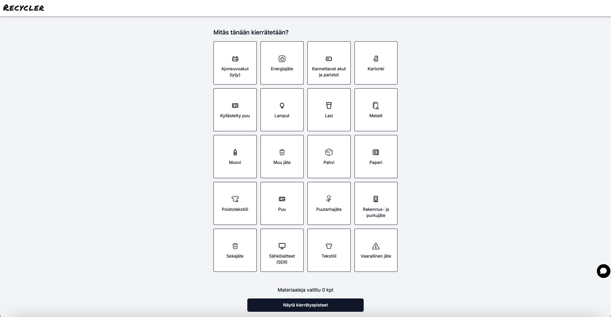
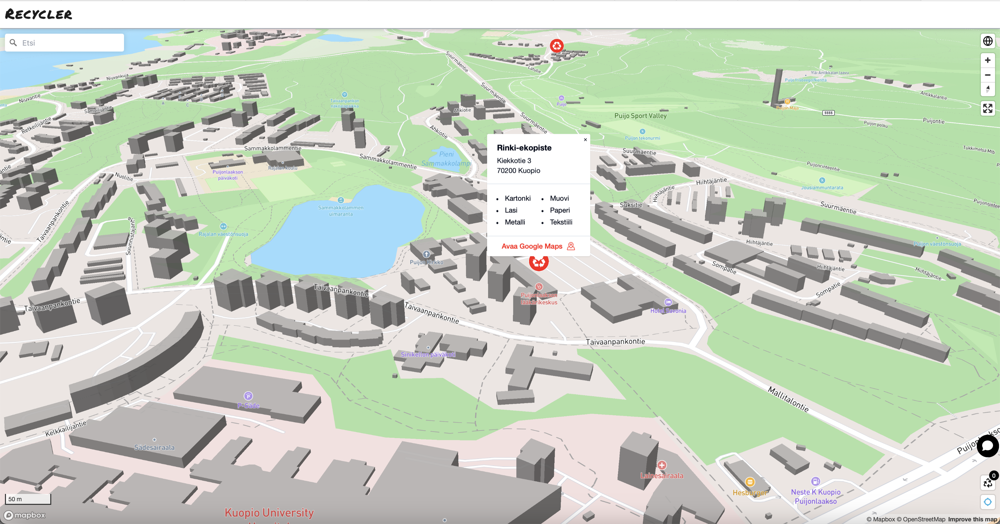

## Overview

_With ReCycler, it’s easier than you think!_

ReCycler is an open-source platform aimed at creating a more modern and user-centric recycling service, building upon the data foundation of the existing kierrätys.info. The ReCycler platform leverages the kierrätys.info API (https://api.kierratys.info/) to obtain basic information about recycling collection spots. Additionally, the service utilizes [Mapbox's](http://www.mapbox.com) mapping and location-based services. The idea of the platform is to provide solutions to various use cases efficiently and seamlessly.

## Demo
You can test the development version of ReCycler at: http://www.recyclerapp.fi. Please note that the development version may not be the same as the version published on GitHub. The current development version of ReCycler also leverages the [Chatling](http://www.chatling.com), which features an AI chatbot trained on dedicated [datasets](ai-training-materials).

## Features
### User-friendly interface for smart recycling guidance
ReCycler provides an intuitive interface featuring a map view that visualizes the locations of recommended recycling collection spots along with detailed information about each site. ReCycler can dynamically display the user’s current location on the map, so the user does not need to adjust the map while moving manually.
### Multi-organization support and admin tools (to be released in 2025)
A single instance of Recycler can be utilized by multiple organizations and multiple use cases, each with their own needs. While the current development demo (www.recyclerapp.fi) focuses on recycling collection points, the platform can be effortlessly adapted to support other use cases as well. A demo of the multi-organization development version will be released later, once the required user interface implementations have reached a sufficient level of readiness.

The multi-organization model requires the development of user management and admin tools to enable flexible and secure access control, organization-specific configurations, and efficient oversight across different domains.
## How to contribute
We welcome contributions from developers, designers, and anyone passionate about sustainable practices. Please follow the guidelines outlined in our [contributing.md](contributing.md) file.
## Installation
To install the ReCycler application, please take a look at the detailed instructions in the [backend/api](/backend/api/README.md) and [frontend](/frontend/README.md) folders.
## About licenses, authors and data sources
ReCycler is open-source and distributed under the [Apache-2.0 license](licence.md). Please feel free to use, modify, and distribute the software according to the terms of the license. This project was originally developed by © Jussi Niilahti and Pirkka Huhtala.

The recycling collection spots data used in this project is sourced from the [Kierrätys.info API service](https://api.kierratys.info).  
All copyrights related to the Kierrätys.info service and its data are held by **KIVO ry** (The Association for Finnish Local and Regional Authorities in Waste Management).  
Use of the data is subject to the terms and conditions of the Kierrätys.info service.

The map interface in ReCycler uses **Mapbox** services for rendering and geospatial data.

Map data and map service © [Mapbox](https://www.mapbox.com/) and its data providers.  
Usage of Mapbox is subject to their [Terms of Service](https://www.mapbox.com/legal/tos) and [Attribution Guidelines](https://docs.mapbox.com/help/getting-started/attribution/).

## Contact
For any inquiries or suggestions, please reach out to us through GitHub. You can contact us by creating an issue in the repository, participating in discussions, or submitting pull requests. We value and welcome your contributions and feedback.
Let's collaborate to create a more sustainable future with ReCycler! :seedling::recycle:
## Screenshots from the development version (www.recyclerapp.fi), February 24, 2025

