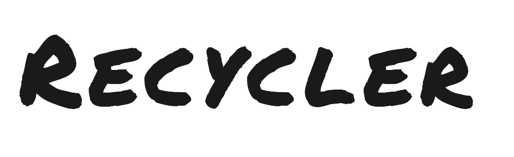

## Overview

_With ReCycler, it’s easier than you think!_

ReCycler is an open-source platform aimed at creating a more modern and user-centric recycling service, building upon the data foundation of the existing kierrätys.info. The ReCycler platform leverages the kierrätys.info API (https://api.kierratys.info/) to obtain basic information about recycling collection spots. Additionally, the service utilizes [Mapbox's](http://www.mapbox.com) mapping and location-based services. The idea of the platform is to provide solutions to various use cases efficiently and seamlessly.

## Demo
You can test the development version of ReCycler at: http://www.recyclerapp.fi. Please note that the development version may not be the same as the version published on GitHub.

### Multi-organization and multi–use case support - "ReCycler Platform" (Development)

ReCycler Platform is designed to support multiple organizations and a wide range of use cases, each with their own requirements and operating models. The platform is not built for a specific domain or single use case, but as a generic foundation that can be configured and extended for virtually any purpose.

The current development demo (www.recyclerapp.fi) showcases recycling collection points as one example use case, but the underlying platform is not limited to this domain. Core development focuses on building reusable tools and capabilities that enable the creation, configuration, and management of use cases independently of their content or context.

The development of these capabilities is ongoing during H1/2026. This includes the implementation of comprehensive user management and administrative tools that allow organizations to:

- create and manage their own use cases,
- define organization- and use case–specific configurations,
- manage users, roles, and access rights securely, and
- ensure clear separation and governance across organizations and domains.
- [Auth0](https://auth0.com/) is utilized as the identity and access management (IAM) solution

A demo of the multi-organization and multi–use case development version will be released once the required user interface components supporting these generic management capabilities have reached a sufficient level of maturity.

#### AI-assisted guidance UI (Development)

The development version of ReCycler includes an AI-powered assistance feature integrated into the user interface. This functionality is designed to help users identify the appropriate service type and location based on their specific need.

The AI support is capable of:

- processing text input provided by the user,
- interpreting spoken input via speech recognition,
- analyzing images (e.g. photos of items),
- understanding the user’s intent and mapping it to the appropriate service type and destination,
- recommending the most suitable collection point or facility,
- providing relevant handling instructions, and
- highlighting nearby locations related to the selected service.

The goal of the AI integration is to reduce uncertainty and make responsible action easier. By focusing on user intent and service matching rather than only material classification, the system supports a broader range of circular economy use cases.

## How to contribute
We welcome contributions from developers, designers, and anyone passionate about sustainable practices. Please follow the guidelines outlined in our [contributing.md](contributing.md) file.
## Installation
To install the ReCycler application, please take a look at the detailed instructions in the [app](/app/README.md) folders.
## About licenses, authors and data sources
Usage of Mapbox is subject to their [Terms of Service](https://www.mapbox.com/legal/tos) and [Attribution Guidelines](https://docs.mapbox.com/help/getting-started/attribution/).
ReCycler is open-source and distributed under the [Apache-2.0 license](licence.md). Please feel free to use, modify, and distribute the software according to the terms of the license. This project was originally developed by © [Jussi Niilahti](https://www.linkedin.com/in/jussi-niilahti) and [Pirkka Huhtala](https://www.linkedin.com/in/pirkka-huhtala/).

The recycling collection spots data used in this project is sourced from the [Kierrätys.info service (API)](https://kierratys.info/tietoa-sivustosta).  
All copyrights related to the Kierrätys.info service and its data are held by KIVO ry (The Association for Finnish Local and Regional Authorities in Waste Management).  
Use of the data is subject to the terms and conditions of the Kierrätys.info service.

The map interface in ReCycler uses Mapbox services for rendering and geospatial data.

Map data and map service © [Mapbox](https://www.mapbox.com/) and its data providers.  
Usage of Mapbox is subject to their [Terms of Service](https://www.mapbox.com/legal/tos) and [Attribution Guidelines](https://docs.mapbox.com/help/getting-started/attribution/).

## Contact
For any inquiries or suggestions, please reach out to us through GitHub. You can contact us by creating an issue in the repository, participating in discussions, or submitting pull requests. We value and welcome your contributions and feedback.

## ReCycler Platform screenshots 

