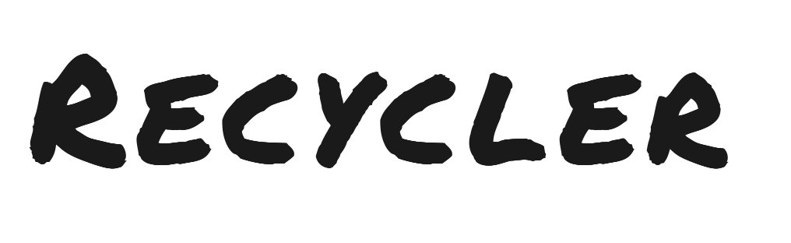
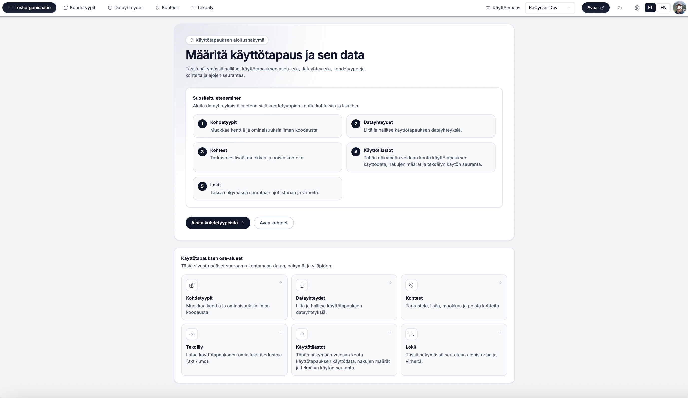
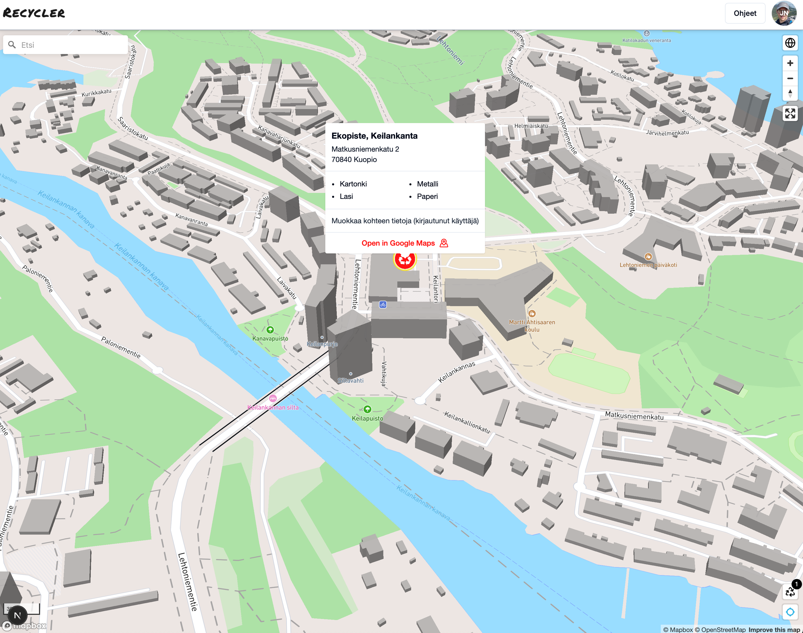
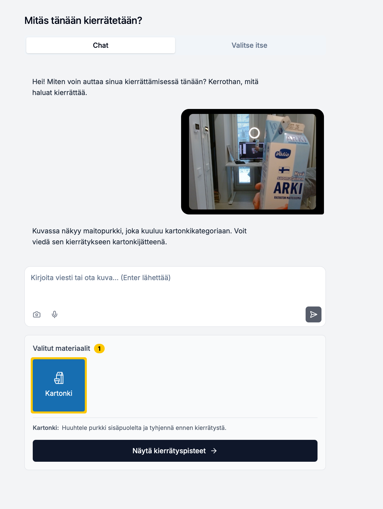
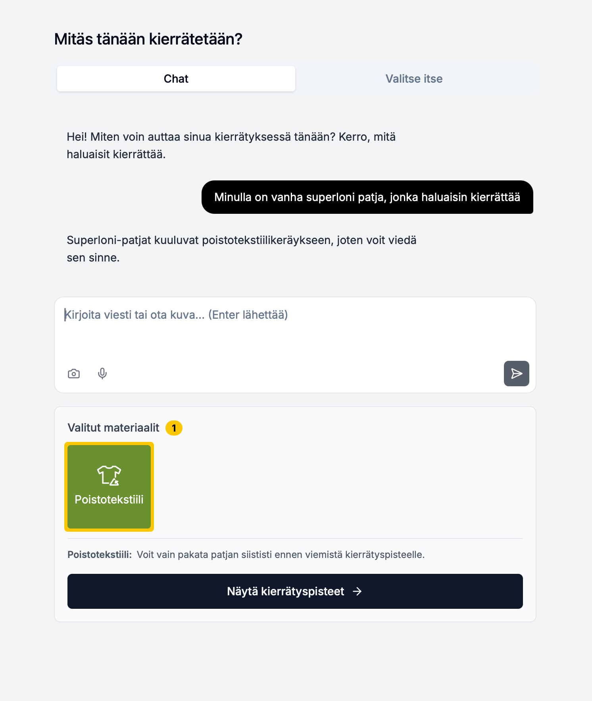

## Overview

_With ReCycler, it’s easier than you think!_

ReCycler is a modern, flexible platform built to digitize and improve circular economy and recycling workflows. Building upon the data foundation of the existing kierrätys.info (provided by KIVO ry), the ReCycler platform leverages the kierrätys.info API (https://api.kierratys.info/) to obtain basic information about recycling collection spots. Additionally, the service utilizes [Mapbox's](http://www.mapbox.com) mapping and location-based services. The platform is designed to handle multiple recycling and material management use cases efficiently and seamlessly.

## Demo
You can test the multi-organization and multi–use case demonstration version of ReCycler at: http://www.recyclerapp.fi. Please note that the development version may differ from the source code published on GitHub.

### Multi-organization and multi–use case support - "ReCycler Platform"

ReCycler Platform is designed to support multiple organizations and a wide range of use cases, each with their own requirements and operating models. The platform is not built for a single domain or use case, but as a generic foundation that can be configured and extended for virtually any circular economy purpose.

The demo (www.recyclerapp.fi) showcases recycling collection points using data from KIVO ry as a primary use case, but the underlying platform capability extends beyond this domain. 

Core capabilities include generic management tools that allow organizations to:

- Define organization- and use case–specific configurations
- Add and maintain target objects (e.g., collection spots) and their metadata (attributes)
- Establish connections to new data sources using data connectors
- Manage users, roles, and access rights securely (utilizing Auth0 for IAM)

#### Multilingual Support (FI / EN)

ReCycler natively supports **multilingual user interfaces and interactions in both Finnish and English**:

- **UI Localization:** Switch seamlessly between Finnish (`fi`) and English (`en`) interface languages.
- **Multilingual AI Guidance:** The AI assistant processes inputs, queries, and instructions in both Finnish and English, ensuring accessible guidance for all user groups.

#### AI-assisted guidance UI

The demo version of ReCycler includes an AI-powered assistance feature integrated into the user interface. This functionality is designed to help users identify the appropriate service type and location based on their specific need.

The AI support is capable of:

- Processing text input provided by the user (Finnish / English)
- Interpreting spoken input via speech recognition
- Analyzing images (e.g., photos of items or waste materials)
- Understanding the user’s intent and mapping it to the appropriate service type and destination
- Recommending the most suitable collection point or facility
- Providing relevant handling instructions in the user's preferred language
- Highlighting nearby locations related to the selected service

## Contributions & Project Status
At this stage, the ReCycler core repository is maintained internally and we are not accepting external code contributions or pull requests from third parties. 

For feature inquiries or custom deployment requests, please contact the maintainers directly.

## Architecture documentation

Architecture documents are maintained under [docs/architecture](docs/architecture).

- Start from [docs/architecture/README.md](docs/architecture/README.md)
- Codebase map: [docs/architecture/codebase_structure.md](docs/architecture/codebase_structure.md)
- Organization and user model: [docs/architecture/organization_registration_and_user_management.md](docs/architecture/organization_registration_and_user_management.md)

## Installation
To install the ReCycler application, please take a look at the detailed instructions in the [app](/app/README.md) folders.

## About licenses, authors and data sources

ReCycler is developed and owned by © [Jussi Niilahti](https://www.linkedin.com/in/jussi-niilahti) and [Pirkka Huhtala](https://www.linkedin.com/in/pirkka-huhtala/).

The platform is distributed under a **dual-licensing model** (AGPL-3.0 / Commercial License). The core maintainers retain full copyright and ownership of the codebase, including the exclusive right to issue commercial licenses.

### Data Sources & Copyrights
- **Kierrätys.info Data:** The recycling collection spot data used in the project demo is sourced from the [Kierrätys.info service (API)](https://kierratys.info/tietoa-sivustosta). All copyrights related to the Kierrätys.info service and its data are held by **KIVO ry** (The Association for Finnish Local and Regional Authorities in Waste Management). Use of the data is subject to the terms and conditions of the Kierrätys.info service.
- **Mapbox:** The map interface in ReCycler uses Mapbox services for rendering and geospatial data. Map data and map service © [Mapbox](https://www.mapbox.com/) and its data providers. Usage of Mapbox is subject to their [Terms of Service](https://www.mapbox.com/legal/tos) and [Attribution Guidelines](https://docs.mapbox.com/help/getting-started/attribution/).

## Contact
For general questions or commercial inquiries, feel free to reach out via GitHub Issues or contact the maintainers directly.

## ReCycler Platform screenshots (examples)

### 2026-08-18

#### Admin user interface:

#### Map user interface:

#### AI image recognition:

#### AI text recognition, speech-to-text feature also available:

---

## Licensing & Commercial Usage

ReCycler is available under a **dual-licensing model**:

1. **Open Source (GNU AGPLv3):** Free for non-commercial use, educational projects, academic research, and open-source derivative works under the terms of the [AGPL-3.0 License](LICENSE.md). Any modified version or service hosted over a network (SaaS) must make its source code publicly available under the same AGPLv3 terms.
2. **Commercial License:** Required for enterprise deployments, proprietary software integration, or commercial SaaS offerings where AGPLv3 copyleft constraints (such as mandatory source code disclosure) cannot be applied.

### License Decision Guide

| Use Case | Applicable License |
| :--- | :--- |
| **Personal / Non-commercial projects** | Open Source (AGPLv3) |
| **Educational & Academic Research** | Open Source (AGPLv3) |
| **Open-source projects (sharing derivative code)** | Open Source (AGPLv3) |
| **Proprietary / Closed-source commercial products** | **Commercial License Required** |
| **Commercial SaaS without releasing source code** | **Commercial License Required** |

### Commercial Licensing & Support

For commercial licensing options, enterprise SLAs, custom deployments, or dual-licensing inquiries, please contact:
- **Jussi Niilahti:** [LinkedIn Profile](https://www.linkedin.com/in/jussi-niilahti)
